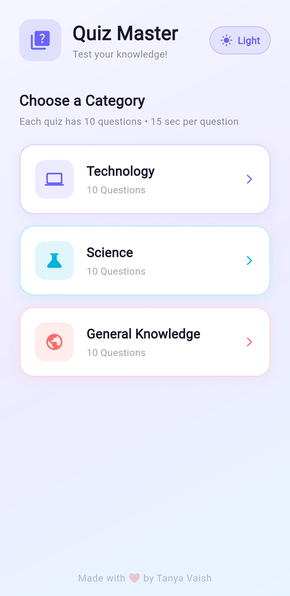
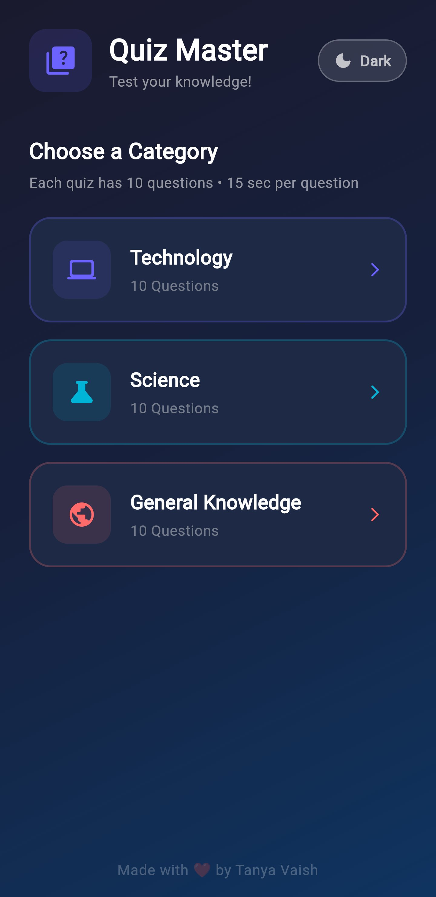
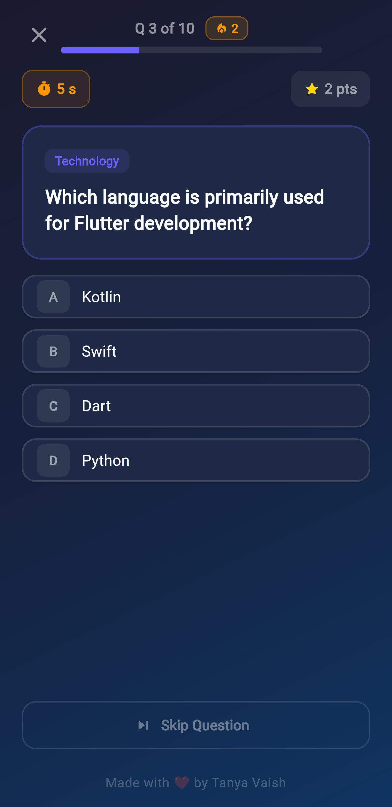
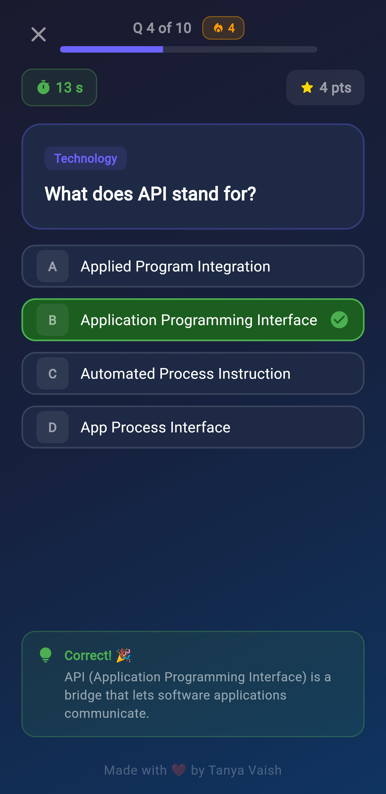
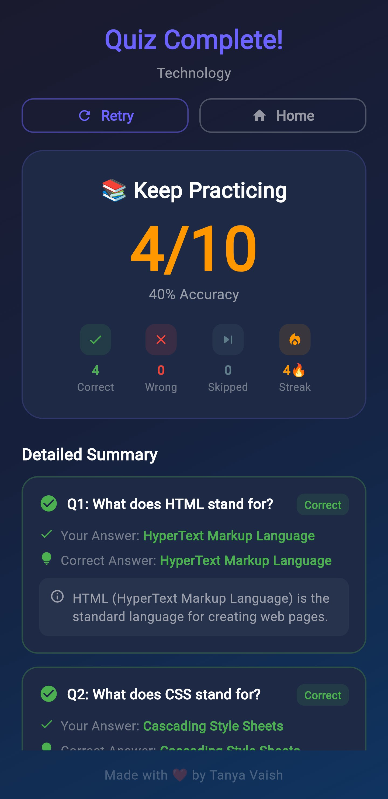

<div align="center">

<!-- Animated Header -->


<!-- Badges Row 1 -->
<p>
  
  
  
</p>

<!-- Badges Row 2 -->
<p>
  
  
  
</p>

<br/>

> **Quiz Master** is a beautifully designed Flutter quiz app with timed questions, streak tracking, category selection, and a detailed result summary — all wrapped in a stunning dark/light theme UI.

<br/>

</div>

---

## ✨ Features

| Feature | Description |
|--------|-------------|
| 🎨 **Light & Dark Theme** | Seamlessly switch between light and dark modes |
| 📚 **3 Quiz Categories** | Technology, Science, General Knowledge |
| ⏱️ **Timed Questions** | 15 seconds per question to keep things exciting |
| 🔥 **Streak Tracker** | Track your consecutive correct answers |
| ⭐ **Points System** | Earn more points by answering faster |
| ⏭️ **Skip Questions** | Option to skip if you're unsure |
| 📊 **Detailed Results** | Full summary with correct/wrong/skipped + explanations |
| 💡 **Answer Explanations** | Learn from every question after answering |

---

## 📸 Screenshots

<div align="center">

### 🏠 Home Screen

<p>
  
  &nbsp;&nbsp;&nbsp;&nbsp;
  
</p>

<p><em>Light Mode &nbsp;&nbsp;&nbsp;&nbsp;&nbsp;&nbsp;&nbsp;&nbsp;&nbsp;&nbsp;&nbsp;&nbsp;&nbsp;&nbsp;&nbsp;&nbsp;&nbsp;&nbsp;&nbsp;&nbsp;&nbsp;&nbsp;&nbsp;&nbsp;&nbsp;&nbsp;&nbsp;&nbsp;&nbsp;&nbsp;&nbsp;&nbsp; Dark Mode</em></p>

---

### ❓ Question Screen

<p>
  
  &nbsp;&nbsp;&nbsp;&nbsp;
  
</p>

<p><em>Before Answering &nbsp;&nbsp;&nbsp;&nbsp;&nbsp;&nbsp;&nbsp;&nbsp;&nbsp;&nbsp;&nbsp;&nbsp;&nbsp;&nbsp;&nbsp;&nbsp;&nbsp;&nbsp;&nbsp;&nbsp;&nbsp; After Answering (with explanation)</em></p>

---

### 📊 Results Summary

<p>
  
</p>

<p><em>Detailed score breakdown with per-question review</em></p>

</div>

---

## 🗂️ Quiz Categories

<div align="center">

| 💻 Technology | 🔬 Science | 🌍 General Knowledge |
|:---:|:---:|:---:|
| 10 Questions | 10 Questions | 10 Questions |
| HTML, CSS, APIs, Flutter & more | Biology, Physics, Chemistry | World facts & trivia |

</div>

---

## 🎮 How It Works

```
1. 🏠  Open the app → Choose a category
2. ⏱️  15 seconds countdown starts per question
3. 🅰️  Pick your answer from 4 options (A, B, C, D)
4. 💡  See instant feedback + explanation
5. 🔥  Build a streak for consecutive correct answers
6. 📊  View full results & detailed summary at the end
```

---

## 🛠️ Tech Stack

```yaml
Framework:    Flutter
Language:     Dart
UI:           Custom Widgets + Material 3
Theming:      Light / Dark Mode Toggle
State:        setState (local state management)
```

---

## 🚀 Getting Started

### Prerequisites
- Flutter SDK installed (`flutter --version`)
- Android Studio / VS Code with Flutter plugin
- A connected device or emulator

### Installation

```bash
# Clone the repository
git clone https://github.com/TanyaVaish-17/quiz_master.git

# Navigate into the project
cd quiz_master

# Install dependencies
flutter pub get

# Run the app
flutter run
```

---

## 📁 Project Structure

```
quiz_master/
│
├── 📁 lib/
│   ├── 📄 main.dart              # App entry point
│   ├── 📁 screens/               # Home, Quiz, Result screens
│   ├── 📁 widgets/               # Reusable UI components
│   ├── 📁 models/                # Quiz & Question models
│   └── 📁 data/                  # Questions data per category
│
├── 📁 assets/                    # Images & icons
├── 📄 pubspec.yaml               # Dependencies
└── 📄 README.md                  # You're here!
```

---

## 👩‍💻 About the Developer

<div align="center">

**Tanya Vaish**
*Flutter Developer • Full Stack Student*

[](https://github.com/TanyaVaish-17)

*"Made with ❤️ by Tanya Vaish"*

</div>

---

<div align="center">

⭐ **If you like this project, please give it a star!** ⭐


</div>
